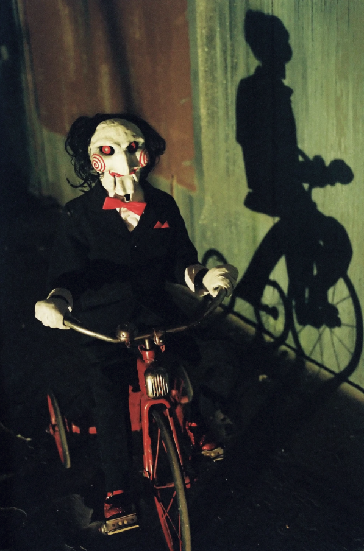

# Вместо предисловия

Привет, студент. Сегодня мы узнаем, что для тебя важнее: собственное время, или же сакральные знания. Я хочу сыграть с тобой в одну простую игру. Она называется ~~ddakji~~ лабораторная работа.

# Вместо основного контента

За оставшееся время тебе предстоит выполнить следующие задания:

1. Форкнуть данный репозиторий
2. Сверстать страницу, отображающую набор карточек в поле размером 3x2:
    1. Размер по горизонтали 3 колонки
    2. Размер по вертикали 2 строки
    3. Пример карточки ты найдешь в `assets/t2`
3. Сверстать страницу с формой регистрации пользователя, удовлетворяющую следующим требованиям:
    1. Наличие поля ввода имени пользователя
    2. Наличие поля ввода адреса электронной почты
    3. Наличие поля ввода пароля
    4. Наличие чекбокса, что пользователь ознакомлен с EULA
    5. Кнопка отправки данной формы
    6. Данная форма должна отображаться по центру экрана и горизонтально, и вертикально
4. Сверстать страницу с формой логина, удовлетворяющую следующим требованиям:
    1. Наличие поля ввода имени пользователя
    2. Наличие поля ввода пароля
    3. Наличие кнопки / кнопок "Войти через" для условных Google / Facebook.
    4. Кнопка отправки данной формы
    5. Данная форма должна отображаться по центру экрана и горизонтально, и вертикально
5. Как ты можешь заметить, я большой любитель техники фирмы Apple. Твоя последняя задача будет элементарной. Тебе надо реализовать эффект magnification как в Dock на компьютерах под управлением операционной системы macOS:
    1. У тебя есть набор картинок
    2. Данные картинки должны быть расположены горизонтально в ряд, по центру экрана.
    3. При наведении курсора на картинку должно происходить следующее:
        * Данная картинка увеличивается в размере
        * Картинки, расположенные на расстояниях +1 и -1 увеличиваются в размере, но не так сильно
        * Картинки, расположенные на расстояниях +2 и -2 увеличиваются в размере совсем немного
    4. Надеюсь, ты понимаешь, что:
        * Это должно работать корректно на первые и последние элементы
        * В консоли не должно быть никаких ошибок
        * Мы пока еще не знаем JS / TS и прочие умные и не очень сокрашения. Ты можешь использовать **только** ванильные HTML и CSS
    5. Какие-то картинки ты найдешь в `assets/t5`
6. Запушить результат работы в свой форк
7. Не забыть подготовить отчет по данной лабораторной работе. Формат - `pdf`. В отчете обязательно указать ссылку на твой форк, который должен быть доступен публично.
8. Дедлайн сдачи отчета ты помнишь: 09/20.

# Вместо послесловия

Время пошло. Ударение в последнем слове можешь выбрать сам.